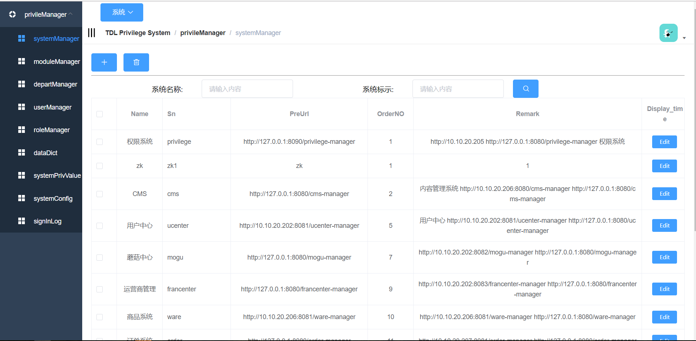

# TDL Privilege System

> a privile system Web , design by vue,vuex,router,store,es5

## Build Setup

``` bash

# Clone project
git clone https://github.com/TwoDragonLake/tdl-web-vue.git

# Install dependencies
npm install

# serve with hot reload at localhost:9528
npm run dev

# build for production with minification
npm run build

# build for production and view the bundle analyzer report
npm run build --report
```

## Demo


## Extra

## Show
### systemManager


### moduleManager


### departManager


### roleManager


### userManager


### systemPrivValue


### dataDict


### systemConfig


### signInLog


## Related Project
https://github.com/TwoDragonLake/tdl-privilege


### License
```
Copyright (c) 2018 TwoDragonLake.

Licensed under the Apache License, Version 2.0 (the "License");
you may not use this file except in compliance with the License.
You may obtain a copy of the License at

http://www.apache.org/licenses/LICENSE-2.0

Unless required by applicable law or agreed to in writing, software
distributed under the License is distributed on an "AS IS" BASIS,
WITHOUT WARRANTIES OR CONDITIONS OF ANY KIND, either express or implied.
See the License for the specific language governing permissions and
limitations under the License.
```
